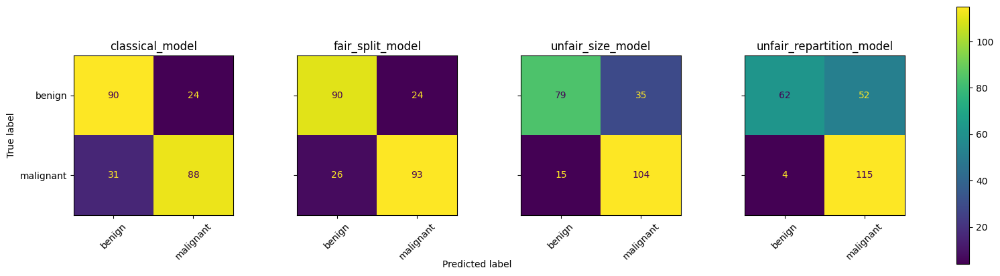

# ML-BIO-PROJECT
ML-BIO Project : Study impact of low data available for federated learning

By:
* RIPOLL Théo
* FISCH Quentin

## Installation
``python3 -m pip install -r requirements.txt``

## Dataset
https://www.kaggle.com/competitions/siim-isic-melanoma-classification/data

This dataset contains 33k cells images in the trainset. The goal is to predicted whether the cell is cancerous or not.

As it's really heavy (30GB), we will load the data and train our models directly on Kaggle so we don't have to download it.

We also want to have a balanced dataset which is not the case by default (about 1.8% cancerous images). So we will downsample the majority class to achieve a 50% rate of cancerous images. It will speed the training process and will also easier for us to compare and interpret the metrics such as the accuracy.

## Model

In order to have better results and to save computation time, we will use a pretrained model that we will fine tune with our data. 
We chose MobileNetV2 which is an efficient networks optimized for speed and memory, with residual blocks.

## Project's structure

### MyFedProx
This is custom code to simulated federated learning. The code is inspired by the TP5 on federated learning and has been adapted to work with the SIIM_ISIC dataset. It contains methods to either do a classical training on a whole dataset that will be used as witness and methods to simulate federate learning used to answer our question.

### Notebooks

They are specifically made to run on Kaggle and won't run on local because the paths won't match.

#### Training
There is several notebooks used to run the training and analyse the results.
* One will serve as a witness and perform a classical training
* One for federated learning with a fair split between clients
* One for federated learning with an unequal split between clients but each subdataset is approximatly balanced
* One for federated learning with an unequal class repartition between clients but approximatly the same size

#### Comparisons
Last notebook will load all different models differently trained and compare their performance on the test dataset.

###
## Results

| model	| accuracy | precision | recall | f1-score |
| :---  |  :----:  |   :----:  | :----: |  :----:  |
| classical_model |	0.763948 | 0.785714 | 0.739496 | 0.761905 |
| fair_split_model | 0.785408 | 0.794872 | 0.781513 | 0.788136 |
| unfair_size_model | 0.785408 | 0.748201 | 0.873950 | 0.806202 |
| unfair_repartition_model | 0.759657 | 0.688623 | 0.966387 | 0.804196 |

If we look at those results we can see that no matter how the data is split among all the clients, the performances stay almost the same.

With the confusion matrix, it's better if we have high values in diagonal. We can see it's the first two models that have the highest values which means the predictions are more accurate. Their predictions are very similar when the dataset is equally split.
The last models have better predictions for cancerous images but have also a lot more false positive

### Conclusion
It looks like the most important is the whole dataset itself that of course will impact a lot the model's performance. If there is enough data, unbiased and balanced. The way we split the dataset among all clients seems to have little impact in federated learning. Interestingly, the f1-score is better with unfair models, but we see a major dropback in the precision, and a very high recal which influences the f1-score to be bigger. Overall, the classical model and the fair split model have the best compromise between all the metrics, compared to the unfair models with big differences.
